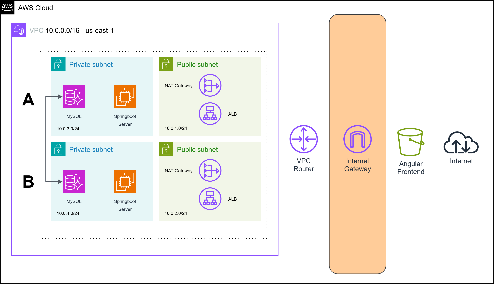

# CureCart

#### Architecture




## Deploy

1) Create a codespace in the `main` branch.
2) Install:
    - the `aws-cli` and setup the AWS credentials
    - the `terraform` cli
3) `cd` into `deploy/tf`
4) Run:
    - ```bash
        tf init
        tf apply
        ```
5) The architecture will be deployed.